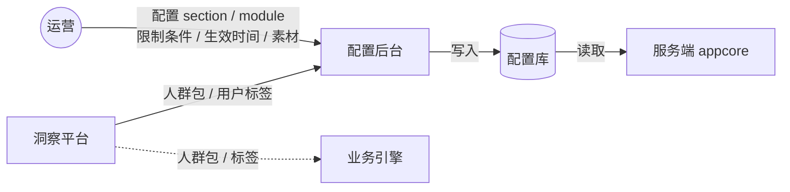
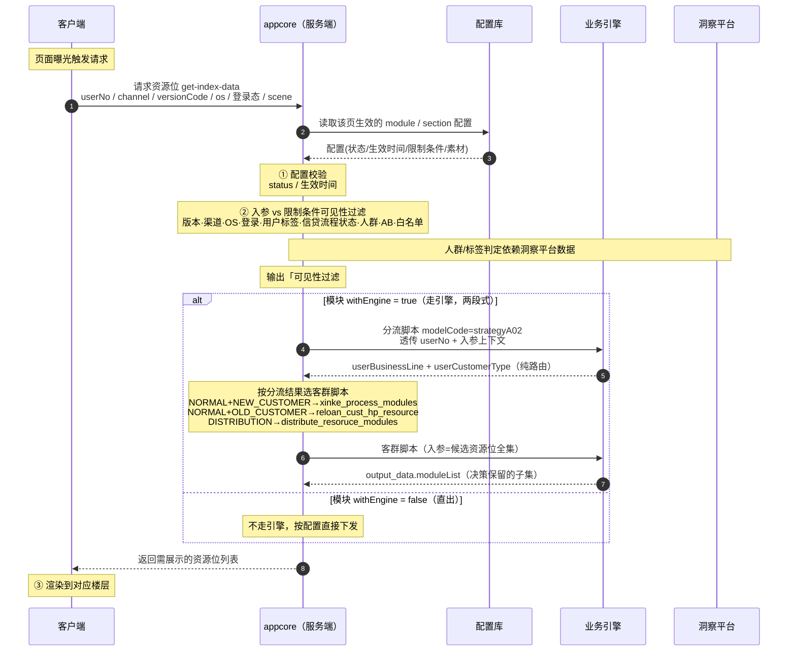

# 资源位平台现状文档

> **用途:** 作为资源位平台的领域知识底座,供 Agent 理解系统全貌后,辅助编写需求文档与配置后台代码。
> **维护说明:** 第一部分(系统交互)基于已确认的链路事实;第二部分(接入清单)用真实样本搭好结构与配置项模板,**完整清单留空待业务方填充**——切勿把不完整的样本当全量清单使用。
> **关联文档:** 诊断逻辑与字段级判定规则见《资源位诊断_字段解析规范.md》。

---

## 第一部分 · 系统交互

### 1.1 系统角色总览

| 系统 | 职责 |
|---|---|
| **客户端** | App 前端。页面曝光时发起资源位请求,接收服务端返回的资源位列表并渲染到对应楼层。 |
| **服务端(appcore)** | 资源位平台核心。聚合配置、执行可见性过滤(配置生效 + 平台限制),决定是否调业务引擎,组装最终资源位列表返回客户端。 |
| **配置后台** | 运营操作台。运营在此配置运营位(section)与模块(module)及其限制条件,写入**配置库**,由 appcore 读取。 |
| **业务引擎(enginepredictprod)** | 决策/筛选引擎。对 `withEngine=true` 的模块,先做客群分流、再按客群脚本筛选最终要展示的资源位。 |
| **洞察平台** | 人群能力方。提供**人群包 / 用户标签**给配置后台(供配置时圈选)和业务引擎(供决策时判定)。 |
| **配置库** | 存储运营位与模块配置的数据源,appcore 的读取来源。 |

### 1.2 配置态交互(运营配置,异步先行)

**备注:**
- 运营在**配置后台**配置运营位和模块,圈选人群时用的人群包/标签来自**洞察平台**。
- 配置落入**配置库**;appcore 在运行时读取配置库获取生效配置。
- 洞察平台的人群/标签能力同时供给**业务引擎**,用于引擎决策阶段的人群判定。
- 此为配置态,与用户请求异步:配置先行,用户请求时读取当时已生效的配置。

### 1.3 运行态交互(用户请求 → 渲染,完整时序)

**关键备注:**
- **两道可见性过滤(appcore 内):** ① 配置校验(配置本身生效与否,与用户无关)② 入参校验(本次请求是否命中限制条件)。两道过滤运营位与模块**取并集**,任一不过即拦截。
- **可见性过滤结论会落日志:** appcore 输出 `可见性过滤#module:{id:类型}` 与 `可见性过滤#section:{id:类型}`,记录每个 module/section 被哪类规则过滤(类型枚举见诊断规范)。
- **引擎为两段式:** 分流脚本 `strategyA02` 只做客群路由(不拦人),客群脚本才做资源位筛选(入参全集 → 出参子集)。`withEngine=false` 的模块直出、不走引擎。
- **引擎调用接口:** 统一为 `http://enginepredictprod.xinfei.io/opt/model/run/sync`,靠 `modelCode` 区分脚本。
- **客户端渲染:** 服务端返回后由客户端渲染;服务端↔客户端交互接口示例 `uri=/xyf/app-page/get-index-data`(该日志同时承载 traceId 与可见性过滤结论)。

### 1.4 引擎两段式分流规则

| userBusinessLine | userCustomerType | 客群 | 资源位脚本 modelCode |
|---|---|---|---|
| NORMAL | NEW_CUSTOMER | 新客 | `xinke_process_modules` |
| NORMAL | OLD_CUSTOMER | 老客 | `reloan_cust_hp_resource` |
| DISTRIBUTION | (任意) | 分发 | `distribute_resoruce_modules` |
| — | — | 客群分流脚本 | `strategyA02` |

> 判客群先看 `userBusinessLine`:`DISTRIBUTION` 直接走分发,与 `userCustomerType` 无关;`NORMAL` 再按 `userCustomerType` 细分新客/老客。

---

## 第二部分 · 接入清单(模板 + 配置项规范)

> ⚠️ 本部分的「已接入清单」均为**对话中出现过的真实样本,非全量**。结构与配置项字段是确定的,可直接用于建模与代码生成;**具体接了哪些页面/模块/运营位,请业务方在留空表格中补全。**

### 2.1 已接入页面

| belongToPage | 页面含义 | 服务端交互接口(uri) | 来源 |
|---|---|---|---|
| `app_index` | App 首页 | `/xyf/app-page/get-index-data` | 样本确认 |
| `app_bill_detail` | 账单详情页 | _待补_ | 样本确认 |
| _待补_ | | | |

> 字段:`app`(如 `xyf` / `xyf01`)、`belongToPage`、`pageType`。

### 2.2 已知 module_type(模块类型)

| moduleType | 含义 | 样本 moduleId | 来源 |
|---|---|---|---|
| `icon_list` | 金刚位/图标列表 | 2701、2715 | 样本确认 |
| `pending_tasks` | 首页待办 | 1003 | 样本确认 |
| `banner` | Banner 位 | 2699 | 样本确认 |
| `drop_ceiling_new` | 吊顶(新) | 2698 | 样本确认 |
| `surprise_3_1` | 惊喜三选一 | 2696 | 样本确认 |
| `collect_info` | 信息收集 | 2703 | 样本确认 |
| `platform_products` | 平台产品 | 2706 | 样本确认 |
| `more_platform_products_entry` | 更多平台产品入口 | 2707 | 样本确认 |
| _待补_ | | | |

### 2.3 已知 section(运营位)样本

| sectionId | sectionName | type | 所属 module | 来源 |
|---|---|---|---|---|
| 805 | 还款卡 | `icon_list_item` | 2715 | 样本确认 |
| 701 | 新客-惊喜三选一 | — | 2696 | 样本确认 |
| 723 | 潜力额度 | — | 2701 | 样本确认 |
| 728 | 结清证明 | — | 2701 | 样本确认 |
| 736 | 7天免息-新客 | — | 2698 | 样本确认 |
| 803 | 信用报告复制 | — | 2699 | 样本确认 |
| 827 | 新客-期望获得额度 | — | 2703 | 样本确认 |
| _待补_ | | | | |

> 完整 section 清单建议从配置库导出后填入。

### 2.4 模块(module)配置项规范

> 字段含义与诊断判定详见《资源位诊断_字段解析规范》;此处为建模/建表用的字段清单。

| 字段 | 类型 | 含义 |
|---|---|---|
| `id` / `name` / `type` | int / string / string | 模块 ID、名称、类型 |
| `app` / `belongToPage` | string | 所属 App、所属页面 |
| `isMarketingModule` | int(0/1) | 是否营销模块 |
| `status` | int(0/1) | 启用状态,1=启用 |
| `displayStatus` | int | 展示状态(枚举待平台确认) |
| `displaySort` | int | 排序,**数值越大优先级越高** |
| `needLogin` | int(0/1) | 点击是否跳登录(不参与可见性) |
| `withEngine` | bool/null | 是否走业务引擎决策 |
| `visibleStartTime` / `visibleEndTime` | datetime | 生效时间窗 |
| `visibleVersionCondition` | object | 版本条件:`conditionType`(ge/all)、`minVersionCode`、`maxVersionCode`、`versionCodeSet` |
| `visibleClientOsList` | array | 可见 OS(`all` 或 ios/android) |
| `visibleChannelList` / `invisibleChannelList` | array | 可见/不可见渠道 |
| `visibleMainStatusList` | array | 可见信贷流程(大状态)列表 |
| `visibleSubStatusMap` | map | 大状态 → 允许的细分状态码列表 |
| `visibleUserTagList` / `invisibleUserTagList` | array | 可见/排除用户标签 |
| `visibleCrowdIdList` / `visibleCrowdIdMap` | array/map | 人群包限制 |
| `visibleAbMap` | map | AB 实验:实验名 → 命中分组 |
| `visibleUserNoList` / `visibleUserPhoneList` | array | 用户号/手机号白名单 |
| `onlyWhiteShow` | int(0/1) | 是否仅白名单可见 |
| `creatorName` / `operatorName` / `createTime` / `updateTime` | — | 审计字段 |

### 2.5 运营位(section)配置项规范

> section 与 module 共用绝大多数可见性字段(`status`/生效时间/版本/渠道/OS/标签/人群/AB/白名单/`onlyWhiteShow` 等),差异字段如下。

| 字段 | 类型 | 含义 |
|---|---|---|
| `id` / `name` / `type` | — | 运营位 ID、名称、类型(如 `icon_list_item`) |
| `belongToModuleId` / `belongToModuleName` / `belongToModuleType` | — | 所属模块(关联键) |
| `belongToBiz` / `bizScenario` / `belongToSubBiz` | — | 所属业务 / 业务场景 / 子业务 |
| `displaySort` | int | 模块内排序,**数值越大越靠前** |
| `extInfoJson` | json string | 素材与跳转配置，**结构因 module_type 而异**，详见 2.7 节 |
| `description` | string | 备注 |

### 2.6 客群脚本(引擎)清单

| modelCode | 角色 | 入参 | 出参 |
|---|---|---|---|
| `strategyA02` | 客群分流(纯路由) | userNo + 入参上下文 | `userBusinessLine` + `userCustomerType` |
| `xinke_process_modules` | 新客资源位筛选 | 候选 moduleList(全集) | 保留的 moduleList(子集) |
| `reloan_cust_hp_resource` | 老客资源位筛选 | 同上 | 同上 |
| `distribute_resoruce_modules` | 分发资源位筛选 | 同上 | 同上 |

### 2.7 运营位 extInfoJson 规范（按 module_type）

> 不同 module_type 的 section，extInfoJson 结构各异。以下按 module_type 逐一记录已梳理的字段，**新增 type 时在此追加一个小节**。

---

#### `surprise_3_1`（惊喜三选一）— section type: `surprise_3_1_item`

**extInfoJson 顶层字段：**

| 字段 | 类型 | 含义 |
|---|---|---|
| `backgroundImageDTO` | object | 背景图配置 |
| `backgroundImageDTO.belongAnimatedImage` | bool | 是否动图，`false` = 静态图 |
| `backgroundImageDTO.staticImageUrl` | string | 背景静态图 URL |
| `choiceList` | array | 可选权益列表，每项为一个选项卡 |

**choiceList 单项字段：**

| 字段 | 类型 | 含义 |
|---|---|---|
| `code` | string | 选项唯一标识，如 `increase_amount_500`、`7_day_coupon` |
| `type` | string | 选项类型枚举（见下表） |
| `templateInstanceId` | int | 权益模板实例 ID，关联权益发放逻辑 |
| `grayedImage` | string | 灰态图 URL（已领取或不可领取状态） |
| `pendingReceiveImage` | string | 待领取状态图 URL |
| `receivedImage` | string | 已领取状态图 URL |
| `clickActionType` | string | 点击行为类型，当前已知值：`platform` |
| `clickActionValue` | string | 点击跳转 URL |

**choiceList[].type 枚举：**

| type | 含义 |
|---|---|
| `increaseAmount` | 提额权益 |
| `coupon` | 优惠券（含息费折扣券、立减券、免息券等） |
| `1rmbCard` | 1元会员卡 |
| `fastReview` | 加速审核通道 |

**section 级附加字段（extInfoJson 之外，接口直出）：**

| 字段 | 类型 | 含义 |
|---|---|---|
| `surpriseBackground` | string | 背景图 URL，与 `extInfoJson.backgroundImageDTO.staticImageUrl` 相同 |
| `surpriseOptions` | array | 选项数组，与 `extInfoJson.choiceList` 对应 |
| `backgroundImageFormat` | string | 背景图格式，如 `png` |
| `backgroundPlayMode` | int | 背景播放模式，`1` = 静态 |

---

#### `promotion_service_item`（促销服务卡，如还款卡）— section type: `promotion_service_item`

所属页面示例：`app_bill_detail`（账单详情页），所属模块示例：账单页-还款卡（id=2729）。

**extInfoJson 顶层字段：**

| 字段 | 类型 | 含义 |
|---|---|---|
| `contentList` | array | 正文富文本片段列表，按顺序拼接渲染 |
| `content` | string | HTML 富文本字符串，与 `contentList` 冗余，供客户端直接渲染 |
| `vipType` | string | 会员/权益大类，如 `huan_kuan` |
| `subVipType` | string | 会员/权益子类，如 `huan_kuan2`，决定跳转参数 |
| `backgroundImage` | string | 背景图 URL，空字符串表示无背景 |
| `backgroundImageDTO` | string/object | 背景图对象，当前为空字符串（未使用） |
| `backgroundImagePlayMode` | string | 背景播放模式，当前为空字符串 |
| `clickActionType` | string | 卡片整体点击行为类型，如 `platform` |
| `clickActionValue` | string | 卡片整体点击跳转 URL |
| `button` / `buttonDTO` | object | 按钮配置（两字段值相同，冗余）|

**contentList 单项字段：**

| 字段 | 类型 | 含义 |
|---|---|---|
| `type` | string | 片段类型，当前已知值：`text` |
| `text` | string | 文字内容，支持 `{{GEN.xxx}}` 动态变量（运行时由服务端注入） |
| `color` | string | 字体颜色，十六进制，如 `#8F96A3` |
| `fontWeight` | string | 字重，如 `400` |
| `effect` | string | 文字效果：`none`=无 / `line-through`=删除线 |
| `clickActionType` | string | 片段级点击行为，空字符串=不可点 |
| `clickActionValue` | string | 片段级跳转 URL |

**已知动态变量（`{{GEN.xxx}}`）：**

| 变量 | 含义 |
|---|---|
| `{{GEN.svc_promotion_current_price}}` | 当前促销价 |
| `{{GEN.svc_promotion_original_price}}` | 原价 |

**button / buttonDTO 字段：**

| 字段 | 类型 | 含义 |
|---|---|---|
| `backgroundImage.belongAnimatedImage` | bool | 按钮背景是否动图 |
| `backgroundImage.staticImageUrl` | string | 按钮背景静态图 URL |
| `clickType` | string | 点击触发方式，如 `call`（直接调用） |
| `clickActionType` | string | 按钮点击行为，如 `openCashier`（打开收银台） |
| `clickActionValue` | string | 按钮点击跳转 URL，`openCashier` 时为空 |

---

## 待确认 / 待补清单

- [ ] 第二部分各「待补」表格:从配置库导出完整的页面 / module_type / section 清单。
- [ ] `displayStatus` 枚举各取值含义(向资源位平台确认)。
- [ ] 信贷流程状态(mainStatus/subStatus)的状态码字典。
- [ ] 服务端↔客户端日志「可见性过滤」字段路径(日志预计下周二上线)。
- [ ] 洞察平台 → 配置后台 / 引擎 的人群包 / 标签具体接口与数据形态(本文按职责关系画出,接口细节待补)。
