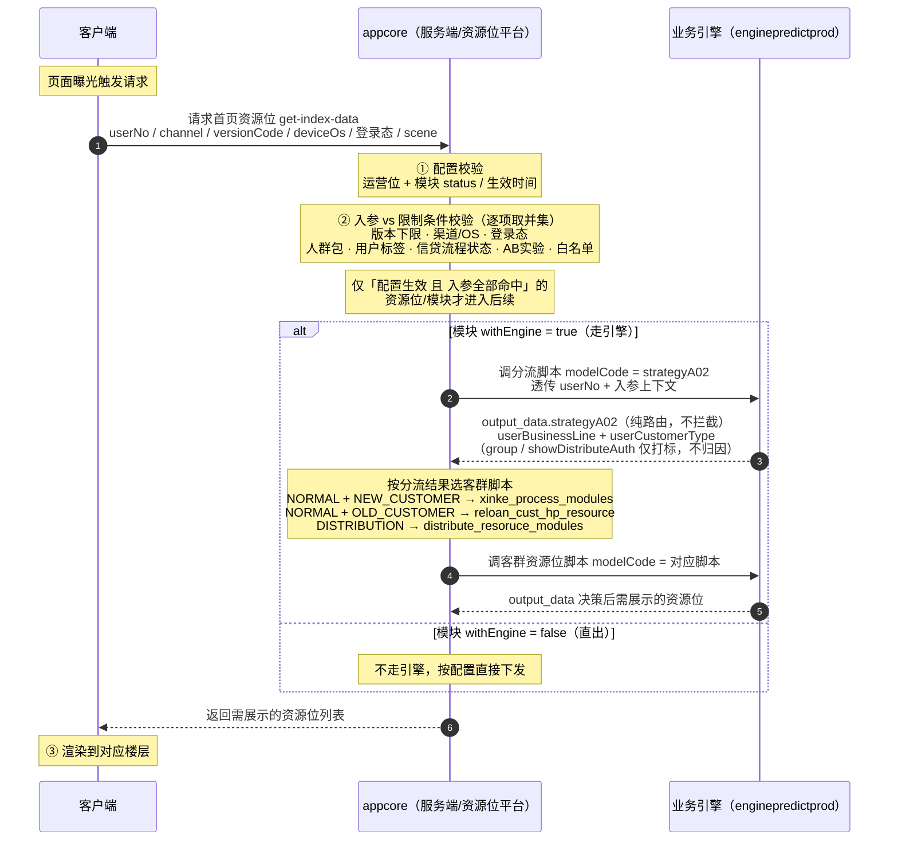

# 「我的资源位为什么不展示」诊断 Agent — 字段解析规范 + 归因规则

> 用途:供 Agent 读取「运营位 + 模块查询接口」与「日志查询接口」的返回后,按统一规则判定拦截层、定位根因、输出归因话术。
> 输入:`userNo` + `section_id`。
> 工具结构(2 个):① 运营位 + 模块查询接口(查配置)② 日志查询接口(分两步:先查 `get-index-data` 服务端日志拿 traceId + 不展示原因,无原因再查引擎日志)。原「用户诊断模拟接口」已废弃——服务端 `get-index-data` 日志已直接给出可见性过滤结论,比模拟更准。

---

## ⚠️ 待办 / 未决事项(TODO)

> 以下两点依赖**下周二(预计)上线的服务端 `get-index-data` 日志**,上线后确认并补全文档对应位置(第五节)。

- [ ] **TODO-1:确认「可见性过滤」记录在日志 JSON 里的字段路径与形态。** 是 message 下某字段的字符串值(形如 `可见性过滤#module:{...}` 一整段文本,需 Agent 解析字符串),还是结构化字段?确定后写实第五节「服务端可见性过滤归因」的取值路径。
- [ ] **TODO-2:确认「response 为空 → 转查引擎」的触发条件与 `可见性过滤` map 的关系。** 待验证假设:目标 sectionId 及其 moduleId **均不在两个过滤 map 中(未被服务端拦截)、且最终 response 未下发该资源位** → 才判定为「可能业务引擎未返回」,进入第二步引擎差集判定。

---

## 一、诊断漏斗总览

按顺序逐层下行,**任一层判定为「不通过」即终止,该层即为根因**,后续层不再排查。

| 层 | 检查点 | 数据来源 | 是否始终执行 |
|---|---|---|---|
| 1.1 | 运营位是否生效 | 工具1 运营位查询 | 是 |
| 1.2 | 所属模块是否生效 | 模块查询接口(用 `belongToModuleId` 关联) | 是 |
| 2 | 是否通过平台限制(运营位 ∪ 模块,取并集) | 工具2 模拟 + 工具3 实际 | 是 |
| 3 | 是否送入业务引擎 | 工具3 派发日志 | **仅当模块 `withEngine=true`** |
| 4 | 业务引擎是否返回 | 工具3 决策日志 | **仅当模块 `withEngine=true`** |
| 5 | 客户端是否渲染 | 工具3 曝光日志 | 是 |
| — | 全部通过 | — | 结论:实际已下发,疑似观察误差 / 缓存 |

**关键分支:** 先读模块的 `withEngine`。`false` / `null` → 模块直出、不走引擎,**跳过第 3、4 层**;`true` → 走引擎,执行第 3、4 层。对不走引擎的模块严禁报「引擎未返回」。

---

## 全链路系统交互时序图

客户端、appcore(服务端/资源位平台)、业务引擎三方的真实交互。appcore 侧有**两道闸**:① 配置校验(配置本身是否生效,与用户无关)② 入参校验(本次请求的真实入参是否命中限制条件);通过后再按 `withEngine` 决定走引擎还是直出,走引擎时为**两段式**(先分流脚本,再按客群调对应资源位脚本)。



### 引擎两段式分流规则

| userBusinessLine | userCustomerType | 命中客群 | 资源位脚本 code |
|---|---|---|---|
| NORMAL | NEW_CUSTOMER | 新客 | `xinke_process_modules` |
| NORMAL | OLD_CUSTOMER | 老客 | `reloan_cust_hp_resource` |
| DISTRIBUTION | (任意) | 分发 | `distribute_resoruce_modules` |

> 判客群时**先看 `userBusinessLine`**:等于 `DISTRIBUTION` 直接走分发脚本,与 `userCustomerType` 无关;`NORMAL` 时再按 `userCustomerType` 细分新客/老客。两段日志靠同一 `request_id` / `EagleEye-TraceID` 关联。

### 与诊断工具的对应

- 第①道配置校验 → 工具1(运营位查询)+ 模块查询接口
- 第②道入参校验 → 工具2(模拟入参校验)+ 工具3(看真实日志命中情况)
- 引擎段 → 工具3 拉 `strategyA02` 分流日志 + 客群脚本日志两条

---

## 二、配置层判定(第 1 层)

运营位和模块是**叠加生效**关系:运营位自己生效 ≠ 能展示,所属模块也必须生效。两步顺序查,任一不过即终止。

### 生效判定规则(运营位、模块通用)

| 条件 | 通过标准 | 不通过 → 根因 |
|---|---|---|
| 存在性 | 接口能查到该配置 | 配置不存在 |
| `status` | `= 1`(启用) | `status=0` → 已下线 / 停用 |
| `displayStatus` | 为有效发布态(枚举见第五节,需平台确认) | 非发布态 → 未发布 / 已下线 |
| 生效时间 | 当前时间 ∈ [`visibleStartTime`, `visibleEndTime`] | 当前时间在窗外 → 未到生效期 / 已过期 |

> 当前时间以接口返回的 `date_time` 字段为准(若有),否则用系统时间。

---

## 三、平台限制层判定(第 2 层)

把**运营位限制与模块限制取并集**,逐项校验,任一不命中即拦截,归因时须标明「拦截来源层(运营位 / 模块)」与「拦截维度」。

### 同名字段的叠加规则

| 维度 | 字段 | 叠加方式 |
|---|---|---|
| 版本下限 | `visibleVersionCondition`(`ge` / `minVersionCode`) | 取两层**更严**的下限(max) |
| 版本上限 | `maxVersionCode` | 取两层更严的上限(min) |
| 生效时间 | `visibleStartTime` / `visibleEndTime` | 取两层**交集** |
| 操作系统 | `visibleClientOsList` | 两层都需命中(交集),`all` 表示不限 |
| 渠道 | `visibleChannelList` / `invisibleChannelList` | 两层都需命中;且须同时满足白名单与黑名单 |
| 用户标签 | `visibleUserTagList` / `invisibleUserTagList` | 命中所有 visible 标签、且不命中任何 invisible 标签 |
| 人群包 | `visibleCrowdIdList` / `visibleCrowdIdMap` | 非空则须命中其一 |
| AB 实验 | `visibleAbMap` | 非空则须命中指定分组 |
| 用户名单 | `visibleUserNoList` / `visibleUserPhoneList` | 非空则须在名单内 |
| 仅白名单 | `onlyWhiteShow` | `=1` 时仅名单内可见 |
| 信贷流程状态 | `visibleMainStatusList` / `visibleSubStatusMap` | 用户当前信贷流程状态须命中其一(大状态 + 细分码两级匹配) |

### 校验要点(踩坑提示)

1. **OS 与渠道是叠加,不是「或」。** 例:运营位 OS = `[ios, android]`,但渠道 `android` 侧仅 `yingyongbao`(应用宝)。则华为 / 小米商店的安卓用户 OS 命中、渠道不命中,仍不展示。两者必须分别校验、都过才算通过。
2. **信贷流程状态是金刚位的核心人群圈定。** `visibleMainStatusList` 给信贷流程的大状态,`visibleSubStatusMap` 给每个大状态下的细分状态码(如 `reloan: "206,207,..."`)。用户当前信贷流程状态须命中「某大状态 + 其下某细分码」两级。工具2 模拟时必须核对这一项。
3. **AB 实验分两类,归因要区分。** 这里 `visibleAbMap` 是**平台可见性层**的实验(属第 2 层);业务引擎决策时的实验分流属第 4 层。两层都可能因实验被拦,话术不要混。

### 不参与可见性判定的字段(勿当拦截条件)

| 字段 | 真实含义 |
|---|---|
| `needLogin` | **点击后是否跳转登录**,不是可见性条件。注意:它和模块的 `visibleUserTagList: logged_in` 是两回事 —— 后者(已登录标签)才是可见性条件。 |
| `displaySort` | 模块内排序优先级,**数值越大优先级越高、越靠前**。不作为不展示判定。 |
| `extInfoJson` | 素材 / 跳转配置,影响展示内容而非是否展示。 |
| `isMarketingModule` | 模块属性标记,不参与拦截判定。 |

---

## 四、引擎层与渲染层判定(第 3 / 4 / 5 层)

仅当模块 `withEngine=true` 时执行第 3、4 层。引擎调用日志 `topic` 均为 `feign-request`、`url` 均指向 `enginepredictprod.../opt/model/run/sync`——**分流脚本和三个客群脚本都打同一个接口,唯一区别是 `request.body.modelCode`**。因此查日志的正确姿势是:先用 `user_no` + 时间范围圈出这一次页面请求的全部 `feign-request`,再**按 `modelCode` 分拣**(`strategyA02`=分流,其余三个 code=客群脚本)。单条日志里 `request` 段对应第 3 层(送入引擎的事实与入参),`response` 段对应第 4 层(决策结论)。检索键用 `request_id` 或 `EagleEye-TraceID`。

| 检查点 | 真实日志字段路径 | 不通过 → 根因 + 责任方 |
|---|---|---|
| 3a 是否有请求 | 有无该用户该场景的 `feign-request` 日志 | 无 → 客户端未发起请求(页面未曝光 / 未访问 / 版本无此位)[客户端] |
| 3b 是否送入引擎 | `message.message.request.body.caller = appcore` + 存在打到引擎的 `url` | 无引擎调用 → appcore 未派发 [平台侧]。**若第 2 层模拟为「通过」,须标注模拟与实际不一致,推断真实状态与模拟假设不符** |
| 4a 引擎调用是否成功 | `response.code = 2000` / `msg = success` | 非成功 → 引擎调用异常 [业务侧] |
| 4b-1 分流脚本(`strategyA02`)·**纯路由,不拦截** | 只读 `output_data.strategyA02` 的 `userBusinessLine` + `userCustomerType` | 不做展示判定。`middle_data.group`、`showDistributeAuth` 均为打标信息、**完全不影响展示,严禁用于归因**。按客群结果定位下一个脚本,进入 4b-2 |
| 4b-2 客群资源位脚本 ·**唯一引擎拦截判定点** | 入参 `request.body.bizData.moduleList`(候选全集) vs 出参 `response.data.output_data.{客群code}.moduleList`(保留子集) | sectionId **在入参全集、却不在出参子集** → 被客群脚本筛除,不展示 [业务侧](详见下方差集判定) |
| 5 是否渲染 | 客户端曝光日志 | 否 → 客户端渲染问题 [客户端](前端逻辑 / 楼层未到) |
| — 全过 | — | 实际已下发展示,提示可能为观察误差 / 缓存 |

> **引擎为两段式调用(详见「全链路系统交互时序图」)。** 第 4 层须串查两条日志:先 `modelCode=strategyA02` **定客群(此步不拦人)**,再按客群 code 查对应资源位脚本日志判断该 section_id 是否被选中。两条用同一 `request_id` 关联。**引擎层的不展示根因只可能出在客群脚本层,strategyA02 不参与归因。**

### 客群脚本(4b-2)差集判定详解

客群脚本做的是**资源位筛选**:入参 `bizData.moduleList` 是该客群的候选资源位全集,出参 `output_data.{客群code}.moduleList` 是引擎决策后保留下来要展示的子集。**用 `sectionId` 在两者间做差集**,即可判定目标资源位是否被筛除。按"没出现"的形态分四种:

| 形态 | 判定 | 归因话术 |
|---|---|---|
| sectionId 在出参对应 module 的 `sectionList` 里 | 展示 ✓ | —— |
| 所在 module 在出参里,但 `sectionList` 不含该 sectionId | 该位被引擎筛除 | 被客群脚本 `{code}` 决策筛除,未保留该资源位 |
| 所在 module 在出参里,但 `sectionList = []` 空 | 模块整体未选中任何位 | 所在模块被客群脚本整体清空 |
| 所在 module 整个不在出参 `moduleList` 里 | 模块整体未下发 | 所在模块未被客群脚本保留 |

判定要点:

1. **匹配键必须用 `sectionId`(数字),不可用 `sectionName`。** 出参里部分 section 只有 id 没有 name(如 `{"sectionId": 828}`)。
2. **`middle_data` 在客群脚本里是 `group_id`(如 `surprise_3_1_choice_na`),是命中的策略分组标识,不是逐条筛除原因。** 日志层面给不出"这个 section 为什么被删"的显式理由,**Agent 归因到"被客群脚本决策筛除"即可,不要硬编更细的原因**;要查具体策略得另看引擎策略配置。
3. **客群一致性交叉核对:** 入参 `bizData.bizLineInfo`(`userBusinessLine` + `userCustomerType`)应与 strategyA02 的分流结论一致;不一致说明分流与客群脚本调用对不上,本身就是异常线索。
4. **`output_data.{code}.size`** 是保留的模块数,可作辅助校验。

### 通用解析要点

1. **调用态 ≠ 决策态。** `code:2000` / `success` 只表示接口调通,**不代表资源位被选中**,是否展示一律看客群脚本的差集结果。
2. **strategyA02 的 `middle_data.group`、`showDistributeAuth` 是打标信息,完全不影响展示,严禁归因。** 分流脚本只出 `userBusinessLine` + `userCustomerType` 做路由。
3. **`output_data` 的 key 是动态的**,等于本次 `modelCode`,解析时按 `request.body.modelCode` 取对应节点。
4. **入参用于交叉验证第 2 层。** 引擎入参里的真实 `channel` / `versionCode` / `os` / `userNo`(分流日志在 `bizData`,客群日志在 `bizData.appInfo`)与工具2 模拟入参比对,可印证「模拟假设与真实状态是否一致」。

---

## 五、日志检索前置配置(工具3 调用契约)

日志服务底层为 **SelectDB(Doris/StarRocks 系)**,查询用 `customSql` 走全文检索语法,**不是** `字段:值` 那种写法。每次调用由「固定前置默认值 + 动态条件」拼成。

### 固定默认值(写死,每次不变)

| payload 字段 | 固定值 | 说明 |
|---|---|---|
| `datasourceName` | `selectdb-product-monitor` | 数据源 |
| `dbName` | `log_db` | 库名 |
| `tableName` | `appcore__app_log` | 表名;**服务名 = 表名前缀**(appcore 日志即此表),查其他服务换表而非加过滤 |
| `timeField` / `sortField` | `log_time` | 时间字段 |
| `sortOrder` | `DESC` | 时间倒序,最新在前 |
| `pageNum` / `pageSize` | `1` / `10` | 分页,可按需调大 |
| `fullTextSearch` / `fieldFilters` | `""` / `{}` | 留空,检索逻辑全放进 `customSql` |

### 动态条件(每次按 userNo / 时间拼)

| payload 字段 | 取值方式 |
|---|---|
| `customSql` | 见下方模板 |
| `startTime` / `endTime` | 时间窗,**ISO 格式且为 UTC**。Agent 须把诊断时间(北京时间)**减 8 小时**转 UTC(如北京 14:19 → `06:19Z`)。默认窗 15 分钟,诊断历史问题时按实际发生时间放宽 |

### customSql 模板

**默认只用 userNo 捞全量,再在结果里按 `modelCode` 分拣:**
```
`_message_` match_all '{userNo}'
```
- 语法为 SelectDB `match_all`,对内置全文字段 `_message_` 匹配,字段名用**反引号**包裹。
- 这一把会捞回本次请求的全部 `feign-request`(分流脚本 strategyA02 一条 + 实际命中的客群脚本一条等),Agent 在结果集中按 `request.body.modelCode` 分拣分流/客群两段。

**⚠️ 不要默认用 modelCode 关键词预设客群。** 用户走新客还是老客脚本是**待诊断的结果**,事先未知;若 `AND match_all 'xinke_process_modules'`,会在用户实为老客时把真正的客群脚本日志过滤掉、查无结果。modelCode 仅作**可选精确化条件**——只有在已确定、且只想精确取某一段(如只要分流日志)时才追加:
```
`_message_` match_all '{userNo}' AND `_message_` match_all 'strategyA02'
```

### 日志两步查法

**第一步 · 查服务端↔客户端日志(`uri = /xyf/app-page/get-index-data`):** 主入口,一次取两样东西 ——
1. 本次请求的 `traceId`(如 `trace_20260611144745421z78kxl`),作为串联引擎日志的关联键;
2. **服务端直接打印的「可见性过滤」结论**(见下),配置层 + 平台限制层被拦的原因这里就有,无需模拟。

**第二步 · 条件触发,查服务端↔业务引擎日志(`url = .../opt/model/run/sync`):** 仅当第一步未给出该资源位的过滤原因、且 response 未下发它时才查(参见 TODO-2),用 traceId 关联,做客群脚本差集判定(见第四节 4b-2)。

### 服务端可见性过滤归因(get-index-data 日志)

> 字段路径形态待 **TODO-1** 确认(日志下周二上线)。已知形态:两条文本记录,key=ID、value=过滤类型。

- `可见性过滤#module:{...}` —— key=`moduleId`,value=过滤类型。例:`"2696":"clientOs"` = 模块 2696 因 OS 不符被过滤。
- `可见性过滤#section:{...}` —— key=`sectionId`,value=过滤类型。例:`"8100":"crowd"` = 运营位 8100 因未命中人群被过滤。

**归因逻辑(section ∪ module 两层,任一命中即根因):**
1. 目标 `sectionId` 在 `#section` map 中 → 取其 value 为根因。
2. 目标所属 `moduleId` 在 `#module` map 中 → 取其 value 为根因(话术注明「被所属模块层过滤」)。
3. 两个 map 都没有该 id → 服务端未拦截、已放行 → 进入第二步查引擎。

**过滤类型(value)枚举 → 归因话术:**

| value | 归因话术 |
|---|---|
| `time` | 不在生效时间内(可用配置接口补出具体生效起止时间) |
| `version` | 版本不满足限制 |
| `clientOs` | 操作系统不符 |
| `visibleChannel` | 渠道不符 |
| `mainStatus` | 信贷流程状态(大状态)不命中 |
| `subStatus` | 信贷流程状态(细分码)不命中 |
| `visibleUserTag` | 用户标签不命中 |
| `crowd` | 未命中人群 |
| `onlyWhiteShow` | 仅白名单可见,用户不在名单内 |

> 此日志已取代原「平台限制层模拟」(工具2 废弃)。配置查询接口退为**佐证细节**用:日志给类型,配置接口补具体值(如 `time` → 具体生效期)。

### 第 5 层(客户端交互)检索配置 —— 待补

服务端↔客户端的曝光/渲染日志接口暂未知,**可能位于另一张表**(如 `{服务名}__app_log`)。确定后补全表名与 customSql。在此之前,第 5 层只能依赖服务端返回日志间接推断,无法独立确认渲染。

---

## 六、枚举判定表(需向平台确认确切含义)

| 字段 | 已观测值 | 推断含义 | 判定 |
|---|---|---|---|
| `status` | 1 / 0 | 1=启用,0=下线/停用 | `1` 才算生效 |
| `displayStatus` | 4(运营位)/ 1(模块A)/ 0(模块B) | 发布态枚举,**含义未定,务必查平台文档** | `0` 视为未生效;其余值需确认 |
| `withEngine` | true / false / null | 模块是否走业务引擎 | `true` 走引擎;`false`/`null` 直出 |
| `onlyWhiteShow` | 0 / 1 | 是否仅白名单可见 | `1` 时强制名单校验 |
| `needLogin` | true / 1 / false / 0 | 点击是否跳登录 | 不参与可见性 |

> `displayStatus` 各取值含义是当前规范里最大的不确定点,上线前务必和资源位平台确认枚举,不要仅凭推断归因。

---

## 七、归因话术模板

- 运营位未生效:`运营位「{name}」已过生效时间(截止 {visibleEndTime}),当前不展示。`
- 模块未生效:`运营位「{name}」生效,但所属模块「{moduleName}」已下线(status=0),导致整体不展示。`
- 平台限制拦截:`运营位/模块要求{维度}={条件},当前用户不满足,被{运营位/模块}层拦截。`
- 未送入引擎(模拟却通过):`平台模拟判定可展示,但实际未派发给业务引擎,推断用户真实{设备/人群/请求时刻}与模拟假设不符。`
- 引擎未返回:`用户被分流为{客群:新客/老客/分发},走{客群脚本code};该资源位在候选全集中,但未出现在引擎保留的结果中,被客群脚本筛除。`(日志不提供逐条筛除原因,如需具体策略另查引擎配置)
- 渲染问题:`资源位已下发,但客户端未渲染,需排查前端展示逻辑。`
- 全链路正常:`全链路均正常,实际已下发展示,可能为缓存或观察误差,建议核对曝光时间点。`

> 多个根因同时成立时,全部列出并标明各自所属层(例:运营位过期 + 模块下线 同时成立)。

---

## 附:实测样例(还款卡 section_id=805)

| 项 | 值 | 判定 |
|---|---|---|
| 运营位生效时间 | 2026-03-31 ~ 2026-04-02 | 当前 2026-06-10,**已过期** ✗ |
| 所属模块(id=2715) `status`/`displayStatus` | 0 / 0 | **模块已下线** ✗ |
| 模块 `withEngine` | false | 不走引擎,跳过第 3/4 层 |

**结论:** 第 1 层即终止,两个根因同时成立 ——
运营位已过生效时间(04-02 截止),且所属模块「首页金刚位726及以上-GroupA」已下线(status=0),任一都会导致不展示。
